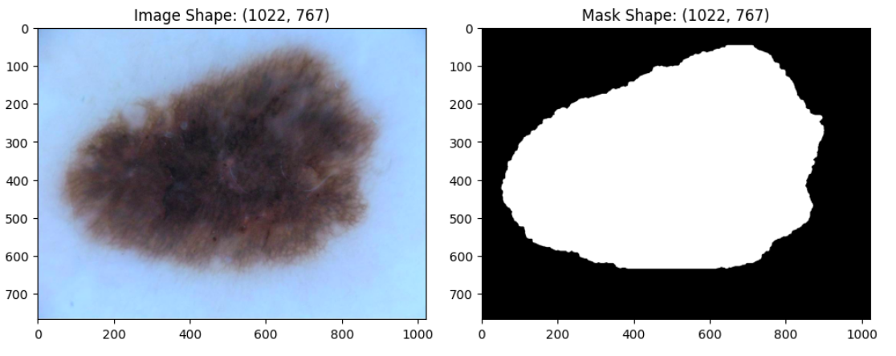
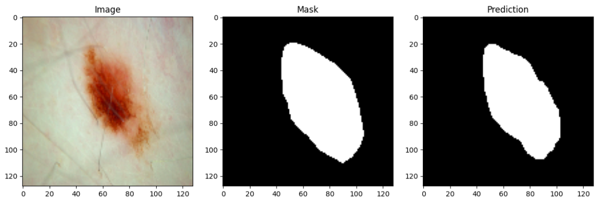

# ISIC Challenge - Lesion Segmentation  

## Goal of the project 

The primary objective of this challenge is to **develop image analysis tools to enable the automated diagnosis of melanoma from dermoscopic images**. 

Skin cancer poses a significant public health concern. Melanoma, the most lethal form of skin cancer, accounts for the majority of skin cancer-related fatalities. Despite its high mortality rate, early detection of melanoma can lead to a survival rate exceeding 95%. Therefore, the objective is to achieve the highest possible performance of **melanoma detecting model**.

## The dataset 

The training dataset contains **900 dermoscopic lesion images** in JPEG format, along with the corresponding segmentation mask.

The ISIC Lesion segmentation dataset is originally introduced in the [ISIC Challenge webpage](https://challenge.isic-archive.com/).

## Architecture

- A **U-Net model** with a reduced number of parameters compared to the vanilla version.
- The file named `segmentation_model.pth` contains the weight parameters of the trained model.
- Execute the `isic-2016-challenge-lesion-segmentation.ipynb` notebook to train the designated model.

## Results

- Sensitivity score: 0.871
- Specificity score: 0.969
- Pixel accuracy: 0.957
- Jaccard score: 0.805
- Dice score: 0.885

